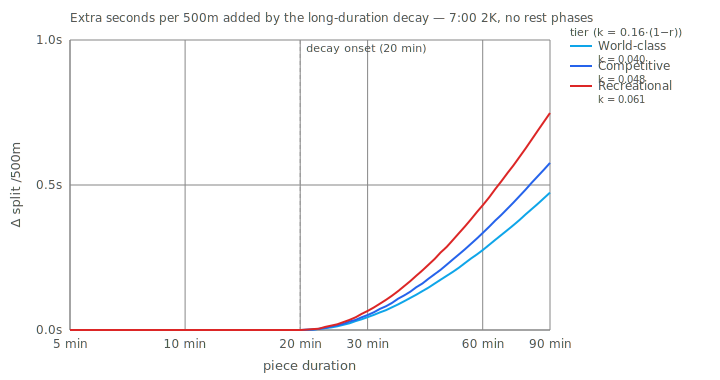

# Erg Pace Equivalents

A small web app that maps your Concept2 2K time to predicted average splits for common erg workouts — and any workout you build — using a Critical Power + W′ model with the Skiba W′bal fatigue simulator.

## Why this exists

The reference pace chart (`Copy of Key Workout Chart.xlsx`) uses fixed multipliers on the 2K split for each workout. That works "okay" for time-based pieces at one implicit fitness profile but has two flaws:

1. It doesn't account for **tier** — the same 2K time at a very aerobic athlete vs. a sprint-biased athlete implies different sustainable power at longer durations.
2. For **distance-based** pieces, the rep duration itself depends on the athlete's pace, which the CP/W′ model captures naturally via a cubic in split.

A surprise from the math: with a fixed CP / P<sub>2K</sub> ratio, the fractional gap between 1K and 2K pace is actually *scale-invariant* in 2K time. So the distance-piece "flaw" is smaller than it first appears. The real issue is tier-agnosticism, which affects all workouts.

## Model

```
Concept2 power/split:    W = 2.80 / (pace_s_per_m)^3  =  350,000,000 / split_s_per_500^3
Critical Power:          P(t) = CP + W' / t
Fatigue (Skiba W'bal):   dW'/dt above CP:  -(P − CP)
                         dW'/dt below CP:  exponential recovery toward W'_max
                           τ = 546·exp(-0.01·(CP − P)) + 316 s
```

For a given workout, the app bisects over work-pace to find the highest constant power at which W′ stays ≥ a small safety floor through the last rep. Distance-based reps have their duration derived from that pace each iteration, so the distance-vs-duration interaction is baked in.

### Tier → CP / P<sub>2K</sub> ratio

| Tier | Ratio | Character |
|---|---|---|
| World-class | 0.75 | Elite, least-squares fit of CP+W'/t to Kurt Jensen's 2K/6K/60′ anchors (100% / 85% / 76% of P₂K) |
| Competitive | 0.70 | Club / collegiate, ~8-11s/500m fade |
| Recreational | 0.62 | Casual / fitness, larger fade |
| Custom | 0.55–0.92 slider | — |

Calibrated from actual (2K, 6K) pair data for a small university program (n=24, scripts/calibrate.mjs) — empirical median ratio was 0.70, matching the new Competitive default. Note that world-class tier uses a higher ratio than this data set because elite rowers maintain a larger fraction of 2K power at longer durations.

CP is then `ratio · P_2K`, and W′ falls out exactly from `P_2K = CP + W'/t_2K`.

If the user supplies a 6K and/or 60s score, CP and W′ are least-squares fit on the (power, duration) points instead — tier becomes just the starting prior.

## Run

```
npm install
npm run dev    # vite at http://localhost:5173
npm test       # 33 unit tests (power↔split, CP/W′ fit, W′bal, predictWorkout)
npm run build  # static output in dist/
```

## File map

```
src/
├── model/
│   ├── pacing.ts         power↔split, tier→CP/W′, least-squares fit, cubic solver
│   ├── wprime.ts         Skiba W'bal simulator + bisection predictWorkout
│   ├── workouts.ts       Rep / WorkoutSegment / Workout / WorkoutPrediction types
│   ├── tiers.ts          Tier definitions and ratios
│   └── presets.ts        Preset workout catalog, grouped
├── components/
│   ├── TierInsight.tsx   CP, W′, sustainable split, implied 6K / 60s
│   ├── WorkoutCard.tsx
│   ├── WorkoutList.tsx   Renders preset groups
│   └── WorkoutBuilder.tsx Custom workout editor (controlled)
├── lib/
│   ├── time.ts           parse/format m:ss.t
│   ├── storage.ts        localStorage (v1)
│   └── urlState.ts       base64url URL hash encode/decode
├── App.tsx
├── main.tsx
└── index.css             CSS variables, light/dark
scripts/
└── sanity.mjs            Quick table of predicted splits across tiers/2K times
```

## Deploy

Any static host. `npm run build` → `dist/` → drop into Cloudflare Pages, GitHub Pages, Netlify, Vercel static. No server, no secrets.

## Long-duration decay

Pure `CP + W'/t` overstates sustainable power beyond ~20 min. A phase-local log decay corrects it:

```
CP_eff(t_phase) = CP · (1 − k · log10(t_phase / 1200))   for t_phase > 1200s
k = 0.16 · (1 − CP/P_2K)                                 (0.04 WC, 0.048 Comp, 0.061 Rec)
```

The decay is reset on any rest phase, so intervals are unchanged; it only bites long continuous efforts (30′, 60′, 10K+). Calibrated so world-class 60′ lands near Jensen's empirical 76% of P₂K (vs ~80% without the correction).

Scaling `k` with `(1 − CP/P_2K)` means less-aerobic tiers fade more on long pieces. The effect is small in absolute terms — even for Recreational, the decay adds under a second per 500m at 60 min:



Regenerate with `npx tsx scripts/plot-decay.mjs` after any change to `DECAY_COEFF` or `DECAY_ONSET_S`.

## Known limits

- **Rest intensity.** Fixed at 100 W in the simulator (light paddle). Users who fully stop recover slightly faster; users who row @ 2:30 pace recover slightly less. Not currently exposed in the UI.
- **Sub-second reps.** Tabata-style 20″/10″ uses sub-second integration steps, but the τ formula itself is coarse at those timescales.
- **Short-duration extrapolation.** Below ~60s the pure CP+W'/t curve over-predicts power (e.g. 60s max distance). No correction applied — this tool is for steady-state and interval workouts, not all-out sprints.

## Calibration

Tier ratios are anchored against published coach-book targets (Jensen for world-class; Wolverine / Concept2 WOD for competitive; C2 beginner guides for recreational) and the reference xlsx's time-based multipliers. Re-run `scripts/sanity.mjs` (via `npx tsx scripts/sanity.mjs`) after changing tier ratios in `src/model/tiers.ts` to eyeball predictions across 6:00 / 7:00 / 7:30 2K × all three tiers.
